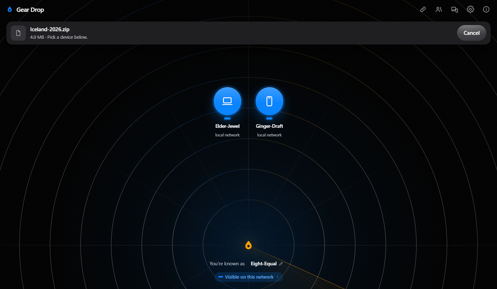
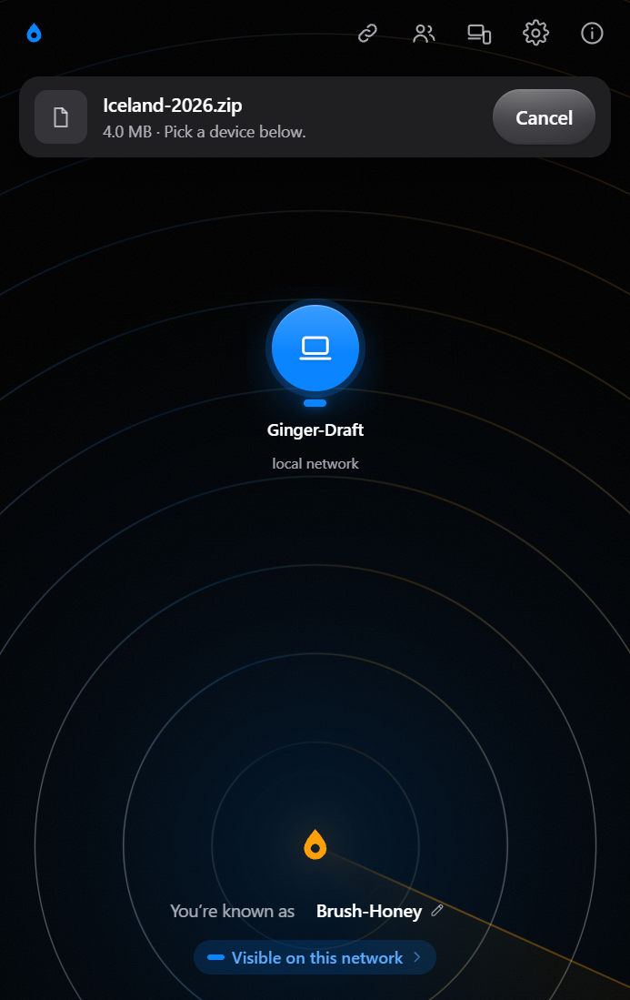

<div align="center">


# Gear Drop

### Send a file straight from one device to another.<br>Nothing in the middle can read it.

[**Open the app →**](https://gear-drop.vercel.app)

[Host your own](DEPLOY.md) · [How it works](#how-it-works) · [What the server sees](#what-the-server-can-and-cannot-see) · [Report a bug](https://github.com/beastops/gear-drop/issues)



</div>

## What it's for

- The photo on your phone that you want on your laptop, right now.
- A 4 GB video that email won't take, and that you'd rather not park in someone's cloud.
- A file for the person sitting opposite you, on a café network you don't trust.
- Your own two machines, on different networks, without signing in to anything.

Gear Drop does all four in a browser tab. No account, nothing to install, and the file goes
from one device to the other rather than up to a server and back down.

## Try it

**On the same Wi-Fi.** Open the app on both devices. They appear to each other on their own.
Pick the device, pick the file, send.

**Anywhere else.** Tap **Add a device** on one and type the six characters it shows into the
other.

Either way, both screens then show the same **four words**. If the words match, you're talking
to the device you think you are. If they don't, something is in the middle — and that is
exactly what the words are for.

Paired devices remember each other, so you only do this once.

## What the server can and cannot see

A small server introduces the two devices to each other. It has to exist, because two browsers
can't find each other on their own. Here is honestly what it gets.

| It can see | It cannot see |
|---|---|
| That some device connected, and from which address — like any website | Your files. They never go through it |
| Roughly when two devices talk to each other | File names, sizes, or your messages — all encrypted before they leave |
| Nothing else. It stores none of it | Enough to pretend to be one of your devices, or to recognise you from one visit to the next |

If a network blocks a direct connection, the app offers to route the data through that same
server instead. It still only ever handles sealed bytes. It asks you first, every time, and
switches back to the direct path as soon as one is available.

## On a phone



It's the same app, and it's built to feel like a phone app rather than a website squeezed into
one: sheets you swipe away, a list that carries momentum when you flick it, and no animation
your phone has to get warm to draw.

| | |
|---|---|
| **Android** | Everything: folders, install to the home screen, share target, notifications, stays awake during a transfer |
| **iOS** | Everything except sending a folder, which Safari accepts and never delivers. Files arrive as a **Save** that opens the share sheet |
| **Desktop** | Everything, plus writing straight to disk on Chromium |
| **Older browsers** | Plainer motion, solid panels. Nothing missing |
| **Private mode** | Works and transfers, and says once that it can't remember pairings |

<br clear="right">

## How it works

The two devices agree on a key **between themselves**. The six characters you type are the
password for that agreement — but they're never sent anywhere, and the server can't work the
key out from watching. Everything after that is locked with it.

The four words come from the key **and** from both devices' connection certificates. Anyone
sitting in the middle has to hold a different key to at least one side, so their words come out
different. That's why checking them is worth the three seconds.

Files travel directly between the two browsers. They're read off disk and written to disk in
pieces, so a 4 GB file needs no more memory than a small one.

<details>
<summary><b>The cryptography, in detail</b> — the parts a reviewer would want to check</summary>

<br>

The six-character code is the password input to a **CPace** PAKE over ristretto255, so the
session key is derived on the two devices and never reaches the relay. Session descriptions,
ICE candidates, file names and sizes are sealed with AES-256-GCM before the relay sees them,
and the four safety words bind the key to both DTLS certificate fingerprints, so anything
relaying in the middle produces different words on the two screens.

A PAKE answers who is on the other end today and says nothing about tomorrow: discrete logs
fall to a quantum computer, so anything agreed this way is readable by whoever kept a copy and
waited. So **ML-KEM-768** runs beside it. Each side publishes a lattice key alongside its CPace
share in the same frame, with no extra round trip, and the session key is derived from the
classical secret and both lattice secrets together, so breaking it needs both. Neither half
alone reaches the key, and the whole exchange is hashed into it, so a key substituted in flight
produces a confirmation that fails rather than two devices that quietly cannot talk.

Thirty bits of code would fall to a GPU in a fraction of a second, so the rendezvous tag costs
600 000 rounds of PBKDF2 salted with a ten-minute epoch. Recovering the code would still only
enable an active attack, which is what the safety words are there to catch.

Both private halves of the exchange, the CPace scalar and the ML-KEM decapsulation key, are
zeroed the moment the session key exists. That is what makes a finished session unrecoverable
rather than merely encrypted.

**Finding each other**

| | how | authenticated |
|---|---|---|
| **paired** | a rotating token from a shared secret and a ten-minute epoch; no code, no server record | yes, the pairing root is folded into the key |
| **this network** | opt-in; the relay labels each socket by the address it arrived on, re-rolled every six hours | no, check the safety words |
| **a room** | a five-character code read out loud, across networks | no, everyone with the code is equal |

A room is a directory rather than a channel: members announce a per-session id, and each pair
then runs the ordinary two-party handshake at its own tag. The relay never carries a group
conversation and cannot list rooms or read a roster.

**What is encrypted, with which key**

Three keys are derived from the session key, so compromising one reads none of the others. All
of this sits inside DTLS as well; this layer is what the relay also cannot read.

| | key | nonce | padded to |
|---|---|---|---|
| Signalling: SDP, ICE candidates | `gd/sig/v1` | lane ‖ counter | 256 B |
| Messages, file names, sizes, acks | `gd/ratchet/v1/`lane, a key per frame | lane ‖ sequence | 256 B, 1 KiB for text |
| File bytes | `gd/xfer/v1` ‖ transferId | file ‖ chunk index | chunk-sized |

Control frames step a ratchet: every frame has its own key, derived forwards from the one
before, so a key recovered from a running device reads that frame and nothing earlier. Each
chunk's GCM tag is bound to its `(file, offset)`, and a hash over those tags verifies the whole
file before it is handed over. Names and messages are padded, so the relay cannot tell a word
from a paragraph.

**Storage and reach**

Received files stream to disk rather than buffering: File System Access, then origin-private
storage, then memory, by capability. The device key and pairing roots are sealed under a
non-extractable key held by the browser, so a copied database yields ciphertext. Where a browser
refuses to store one, pairings are dropped on reload rather than written in the clear.

The only sources for sending are the file input and dropped files: no `showOpenFilePicker`, no
directory picker, no path read anywhere. File names from a peer are composed to NFC and stripped
of direction overrides, zero-width marks, control characters and path separators, so
`holiday‮gnp.exe` cannot arrive looking like a photo. Files that open by running are labelled.
Nothing is blocked.

</details>

## Speed

Measured on one laptop, two browser contexts, over loopback:

| | |
|---|---|
| 512 MB transfer | 15.8 s, 272 Mb/s |
| Peak memory while receiving | 12 MB |
| Cost of the encryption | within noise of the raw channel |

Open `web/bench.html` to reproduce it on your own machine.

## Run it yourself

```bash
npm install
npm start          # http://localhost:3000
npm test
```

[`DEPLOY.md`](DEPLOY.md) covers hosting. It runs on free tiers, and the app and the relay can
live on different services — Cloudflare Workers or Deno Deploy for the relay, Vercel or any
static host for the app.

## What's inside

```
server/   the relay: moves opaque bytes, keeps nothing
web/      the client: crypto, transport, transfer engine, UI, benchmark
deploy/   the same relay for Cloudflare Workers and Deno Deploy
test/     crypto core, protocol invariants, discovery, relay, receive path, UI
docs/     protocol spec, architecture, and the research behind both
```

No bundler and no minifier. The browser runs exactly the files in `web/`, which means you can
read what you're running.

| | |
|---|---|
| [`06-gear-drop-protocol-spec.md`](docs/06-gear-drop-protocol-spec.md) | the wire protocol, implementable from the document alone |
| [`05-gear-drop-blueprint.md`](docs/05-gear-drop-blueprint.md) | threat model, crypto core, discovery, transport |
| [`07-roadmap-and-benchmarks.md`](docs/07-roadmap-and-benchmarks.md) | milestones, targets, measured results |
| [`01`](docs/01-pairdrop-architecture.md)–[`04`](docs/04-competitive-landscape.md) | research: how comparable tools work, and where they break |

## Not done yet

Parallel lanes exist in the transport but aren't yet benchmarked as a win. The WebTransport
relay path, resuming across a full page reload, and streaming zip are open. See
[`07-roadmap-and-benchmarks.md`](docs/07-roadmap-and-benchmarks.md).

## The one thing you do have to trust

This is a web page, so every time you open it you're trusting the code this address sends you.
Everything above is built so that's the *only* thing you have to trust — and the app says so
itself, on its own About screen, rather than leaving you to find out.

## Licence and credits

Gear Drop is [AGPL-3.0-or-later](LICENSE).

It's an independent implementation, written from the protocol behaviour documented in
[`docs/01`](docs/01-pairdrop-architecture.md)–[`docs/03`](docs/03-defects-and-limits.md). No
PairDrop or Snapdrop source is copied, adapted or linked. Those notes were taken while reading
their published source, which is not redistributed here. Both are fine projects and the reason
this one knows what to aim at.

Four libraries are vendored under [`web/vendor/`](web/vendor/README.md) so the app fetches
nothing from anywhere else: `@noble/curves`, `@noble/hashes` and `@noble/post-quantum` (MIT),
and `libheif` (LGPL-3.0), which decodes iPhone photos and is downloaded only by someone who
actually has one. Each licence sits beside the code it covers, and a test checks every vendored
file against what npm published.

## Contributing

Issues and pull requests are welcome — [open one here](https://github.com/beastops/gear-drop/issues).

Two house rules, both learned the hard way. Every fix arrives with a test that has been *seen to
fail* without it, because this repo has shipped tests that asserted nothing and looked green.
And nothing that touches the crypto or the wire format ships without the spec in
[`docs/06`](docs/06-gear-drop-protocol-spec.md) being updated in the same change.
